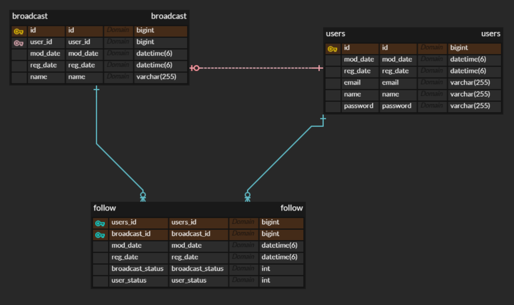

# 방송 API

## Entity

## 기본 설명

### API
* API
  * BroadcastController
    * POST /broadcast
      * 방송국 등록 (미 등록시 일반 User)
    * GET  /broadcast/{id}
      * 방송국 상세 조회
    * GET  /broadcast/users/{id}
      * 방송국 Fan 상세 조회
    * GET  /broadcast
      * 방송국 리스트 조회(페이징)
    * PUT  /broadcast (DJ가 사용자를 Block)
      * 방송국 데이터 수정
  * FollowController
    * POST /follow
      * 방송국 Follow 하기
    * PUT  /follow
      * Follow Block (사용자가 DJ를 Block)
  * Sign
    * POST /sign/up
      * 회원 가입
    * POST /sign/in
      * 로그인
* 테스트
  * BroadcastControllerTest
  * FollowControllerTest
  * SignControllerTest
  
> Multi Thread로 동시성 테스트 필요 -> // TODO

### Branch
* master
  * feature/** 개발 완료 된 Branch Core
* feature/**
  * 대문자
    * 기능 개발 용
    * ex) feature/GET_BROADCAST_CONTROLLER
  * 소문자
      * Core 기능 개발 및 기본 설정
      * ex) feature/db_setting
    
###  Docker Mysql DB 설정
1. ```docker pull mysql```
    * Docker Mysql Image Pull
2. ```docker volume create mysql-volume```
    * Docker Volume 생성
    * Mysql DB 유지용
3. ```docker run -d --name mysql-container -p 3306:3306 -e MYSQL_ROOT_PASSWORD=root -v mysql-volume:/var/lib/mysql mysql```
    * Docker DB 실행
    * Mysql을 별도로 노트북에 설치 안하고 사용하여 3306으로 포트포워딩 사용했습니다.
    * MYSQL_ROOT_PASSWORD=root
        * 비밀번호 root 초기화

* Docker 사용시 setup.sql을 Volume Mount 하겠지만 아래의 databases를 만들어 주세요
```sql
    create database order
```

### Docker Redis DB 설정
1. ```docker pull redis/redis-stack```
    * Docker Redis Image Pull
    * 기본 Redis 에는 여러 모듈이 빠져있으므로 전체 모듈이 들어 있는 redis-stack을 설치 하였습니다.
2. ```docker volume create redis-volume```
    * Docker Volume 생성
    * Mysql DB 유지용
3. ``` docker run -d --name redis-container -p 6379:6379 -v redis-volume:/backup redis```
    * Docker DB 실행
    * Redis 기본 port 6379로 포트포워딩
    * Redis 사용시 redis-cli 명령어 입력후 사용 가능

## Project 구조 및 설명
```
src
├─main
│  ├─kotlin
│  │  └─com
│  │      └─broadcaster
│  │          └─api
│  │              ├─ BroadcasterApiApplication.kt
│  │              ├─ common
│  │              │  ├─ exception
│  │              │  │     ├─ ControllerAdvice.kt // 중앙 Exception 처리
│  │              │  │     ├─ CustomAuthenticationException.kt // 인증 CustomException 
│  │              │  │     └─ CustomException.kt // CustomException
│  │              │  └─ response
│  │              │        ├─ CommonRes.kt   // 공통 Response 
│  │              │        ├─ ResponseMsg.kt // Response 상태 및 Result
│  │              │        └─ ValidInfo.kt // Validate Exception시 Response
│  │              ├─ config
│  │              │  ├─ JpaConfig.kt
│  │              │  ├─ QueryDSLConfig.kt 
│  │              │  ├─ RedissonConfig.kt
│  │              │  ├─ SecurityConfig.kt
│  │              │  └─ security
│  │              │         ├─ JwtAuthenticationEntryPoint.kt // Token 인증 실패 EntryPoint
│  │              │         └─ JwtRequestFilter.kt // 토큰 인증 
│  │              ├─constant
│  │              │     └─ FollowStatus.kt // Follow 상태 ENUM( NORMAL, BLOCK )
│  │              ├─controller
│  │              │     ├─ BroadcastController.kt // 방송국 API
│  │              │     ├─ FollowController.kt // Follow API
│  │              │     └─ SignController.kt // 회원가입 API
│  │              ├─dto
│  │              │  ├─ PageDTO.kt // Page 관련 DTO
│  │              │  ├─broadcast
│  │              │  │    ├─ BroadcastDataDTO.kt // 방송국 기본 DTO
│  │              │  │    ├─ BroadcastDetailDTO.kt // 방송국 상세 DTO
│  │              │  │    └─ BroadcastUpdateDTO.kt // 수정 DTO
│  │              │  ├─follow
│  │              │  │    ├─ FollowDTO.kt // Follow DTO
│  │              │  │    └─ FollowUpdateDTO.kt
│  │              │  ├─sign
│  │              │  │    ├─ SignDTO.kt // UserDetails를 상속 받은 DTO
│  │              │  │    ├─ SignInDTO.kt // 로그인
│  │              │  │    └─ SignUpDTO.kt // 회원가입
│  │              │  └─users
│  │              │        └─ UsersDataDTO.kt // 사용자 정보 DTO
│  │              ├─entity
│  │              │  ├─ Common.kt // 공통 Entity (regDate, modDate)
│  │              │  ├─ broadcast
│  │              │  │     └─ Broadcast.kt // 방송 Entity
│  │              │  ├─follow
│  │              │  │     ├─ Follow.kt // Follow Entity
│  │              │  │     └─ FollowId.kt // Follow 멀티 키
│  │              │  └─users
│  │              │       └─ Users.kt // 사용자 Entity
│  │              ├─repository
│  │              │  ├─broadcast
│  │              │  │  ├─ BroadcastRepository.kt // 방송 JPA
│  │              │  │  └─impl
│  │              │  │      └─ BroadcastRepositoryImpl.kt // 방송 QueryDSL ( 방송국인데 특정 정보만 출력을 하기 위해 사용)
│  │              │  ├─follow
│  │              │  │    └─ FollowRepository.kt // Follow JPA
│  │              │  └─users
│  │              │       └─ UsersRepository.kt // 사용자 JPA
│  │              ├─service
│  │              │    ├─  BroadcastService.kt 
│  │              │    ├─  FollowService.kt
│  │              │    ├─  RedisService.kt
│  │              │    ├─  SignService.kt
│  │              │    └─  UserService.kt // 사용자 로그인 및 인증을 위한 Service
│  │              └─utils
│  │                   └─ JwtUtil.kt // 토큰 생성
│  └─resources
│        └─ application.yml
└─test
    ├─kotlin
    │  └─com
    │      └─broadcaster
    │          └─api
    │              ├─controller
    │              │      ├─ BroadcastControllerTest.kt 
    │              │      ├─ FollowControllerTest.kt
    │              │      └─ SignControllerTest.kt
    │              ├─dto // Controller 테스트 데이터
    │              │  ├─ Broadcast.kt
    │              │  ├─ Follow.kt
    │              │  ├─ SignIn.kt
    │              │  └─ SignUp.kt
    │              └─utils
    │                  ├─ ConverterUtil.kt // 테스트에 필요한 DTO -> JSON Converter
    │                  └─ TestUtil.kt
    └─resources
          ├─ application-test.yml
          └─ data-test.sql // 테스트 시 필요한 Seed Data
```
## Build Spec
* JDK
    * temurin jdk 17
* FrameWork
    * Spring Boot 2.7.14
* Plugin
  * Kapt
  * jpa
* DB
    * Mysql
    * Redis
    * JPA:2.7.14
    * QueryDSL
* TEST
    * datafaker:2.0.1
        * 테스트 데이터 용
    * spring-boot-starter-test

# 후기
0. build.gradle (Groovy VS KTS)
> Spring Boot로 개발을 하면서 주로 Groovy를 사용하였다. <br>
> 하지만 코틀린에서는 KTS를 사용하는 것이 더 좋은거 같다. <br>
> 커뮤니티에서도 KTS로 설정 하는 방법이 더욱 잘 나와있다. <br>
> Groovy를 사용하면서 QueryDSL 을 설정 하면서 시간을 더욱 지체 한거 같다. <br>
> 다음 부터는 KTS를 사용해야 겠다.

1. Docker Redis
> Docker Redis를 설치 해서 사용을 하였다.<br>
> 하지만 기본 Redis는 JSON 등 모듈이 설치 되어 있지 않고 모듈로 설치 해야 하지만 모듈이 이제 지원을 종료 하였다.<br>
> 그래서 redis-stack을 사용하여 개발 하였다.<br>
> 물론 현재 프로젝트에서는 필요 없는 모듈이지만 나중을 위해 알아 두는게 좋을거 같다.<br>
> 참고_1 : https://hub.docker.com/r/redislabs/rejson

2. 인원이 많아 졌을때 Follow Cnt 
> Mysql에서 Follow수를 가져오는 방법은 2가지가 있다.<br>
> 1. 출력 할때 마다 Count(*)를 한다. 
>    * Mysql Cost(부하) 가 인원이 많아 질수록 커진다.
> 2. Follow할때 마다 특정 컬럼에 +,- 를 한다.
>    * 동시성 제어와 정확한 데이터 유지가 어렵다.<br>
>
> 위의 작성한 단점들 때문에 Mysql을 그대로 사용하기 힘들다<br>
> 그래서 Redis를 사용하였다. <br>
> Redis는 싱글 쓰레드 방식과 캐시 메모리의 빠른 장점으로 순차적으로 데이터가 입력 되기 때문에 위 문제가 해결된다.<br>
> 하지만 캐시 메모리이기 때문에 휘발성 이 있는 데이터이다. <br>
> 그래서 주기적으로 백업 처리가 필요하거나 서버를 재 시작 할때마다 다시 설정하는 로직을 추가 해야 한다.
    
    TIP.!! Sorted Set을 사용하여 Follow순으로 랭킹을 매길수 있으며 데이터도 빠르게 저장된다. 

3. QueryDSL

> JPA는 AUTO Increments일때 Bulk Insert가 되지 않는다.<br>
> 이를 방지 하기 위해 QueryDSL을 사용 하였다. <br>
> 하지만 이번 프로젝트에서는 적용하지 못했다.<br>
> 현재 Spring Boot는 2.7 버전으로 hibernate가 버전으로 bulk insert가 적용되지 않는다.<br>
> 하지만 Spring Boot 3.2 버전부터 hibernate 6 버전을 사용하여 Bulk Insert등을 사용할수있다.<br>
> 이를 위해 Spring Boot 3.2 로 다시 재 구성을 하는게 좋을거 같다.(KTS 적용해서)
